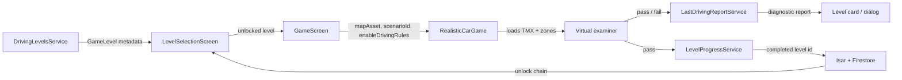

# Level system — curriculum, progress & difficulty

| Field | Value |
|-------|--------|
| **Status** | Done |
| **Author** | Agent (documenting existing system) |
| **Created** | 2026-06-26 |
| **Related** | All `GameLevel` entries in `driving_levels_service.dart` |

---

## Goal

Provide a single reference for how practical driving **levels are authored**, how **player progress** is recorded and used for unlocks, and how **curriculum progression** works — so new levels, maps, and features stay consistent with the existing engine.

## Non-goals

- Changing gameplay code or TMX assets in this task.
- Defining roundabout pass/fail rules (still pending a future spec; Roundabout Basics remains rules-disabled per §4b in core rules).
- Theory tests, road-signs MCQ curriculum, or minigame progression (separate systems).

---

## Background

- Canonical zone and scoring behaviour: [`../core-game-rules.md`](../core-game-rules.md) — §1–§6.
- Level catalog: `lib/services/content/driving_levels_service.dart`.
- Level model: `lib/models/driving/game_level.dart`.
- Runtime: `lib/screens/driving/game_screen.dart` → `lib/game/driving_game.dart`.
- Completion progress: `lib/services/progress/level_progress_service.dart` → `lib/data/repositories/progress_repository.dart` (Isar + Firestore sync).
- Attempt reports: `lib/services/progress/last_driving_report_service.dart`.
- Level picker UI: `lib/screens/driving/level_selection_screen.dart`.

---

## Architecture



**Levels are not procedural.** Each playable lesson is:

1. A **`GameLevel` row** in `DrivingLevelsService` (metadata + unlock graph).
2. Optionally a **TMX map** in `assets/tiles/` with collision, spawn, and rule zones.
3. Optionally a **`scenarioId`** that selects behaviour when multiple lessons share one map.

---

## Curriculum structure

### Player-facing learning path

PLAY from the home menu opens a **consolidated learning path** (`assets/config/learning_path.json`) instead of separate Theory Test / Driving Test hubs. Each path **module** chains theory steps, practical `GameLevel` ids, and a **module test** (`module_final`); a **grand final** node completes when all module tests are passed. Module test content: `assets/config/module_finals.json`. Path nodes reference existing theory / road-signs module ids and `GameLevel.id` values — catalogs in `theory_curriculum.json`, `road_signs_curriculum.json`, and `driving_levels_service.dart` remain authoring sources. Specs: [`2026-06-26-learning-path.md`](./2026-06-26-learning-path.md), [`2026-06-27-module-final-assessments.md`](./2026-06-27-module-final-assessments.md).

### Topics and modules

| `DrivingTopic` | `moduleId` values (when used) | Hub screen |
|----------------|-------------------------------|------------|
| Junctions | `t_junction`, `cross_junction`, `roundabout` | Topic → module picker |
| RoadMarkings | `lane_lines`, `other_markings` | Topic → module picker |
| EmergencySituations | `emergency_vehicles` (Ambulance submodule) | Topic; `emergency_vehicles` id opens category hub |
| WeatherConditions | — | Topic → level list (Adverse Weather) |
| RoadSigns | — | All levels under development |
| Parking | — | All levels under development |
| Practice | — | Empty list |

### Key `GameLevel` fields

| Field | Purpose |
|-------|---------|
| `id` | Stable progress key (e.g. `junctions_t_left`) |
| `topicLevel` | Sort order within topic/module |
| `unlockRequirementIds` | All listed ids must be **completed** to unlock |
| `isUnlocked` | Used only when `unlockRequirementIds` is **empty** |
| `mapAsset` | TMX filename under `assets/tiles/` |
| `scenarioId` | Engine scenario key (same map, different objectives) |
| `enableDrivingRules` | `false` = map + collision only, no zone pass/fail |

**Progression** is conveyed by `topicLevel`, module order, and the unlock chain — not by Easy/Medium/Hard labels (removed 2026-06-26).

### Unlock logic

```text
if unlockRequirementIds is empty:
  unlocked = level.isUnlocked   // author default (e.g. first T-junction, Zebra, Ambulance)
else:
  unlocked = every id in unlockRequirementIds is in completedLevelIds
```

Special cases:

- `emergency_ambulance` unlock checks also accept legacy id `emergency_vehicles`.
- Levels flagged **under development** in `LevelSelectionScreen` are **always locked** regardless of progress (Parking, Road Signs, and named placeholder ids).

### Unlock graph (current catalog)

```text
Junctions — t_junction
  junctions_t_left (open) → junctions_t_right

Junctions — cross_junction
  junctions_cross_basics ← junctions_t_right
  junctions_cross_advanced ← junctions_cross_basics (no map yet)

Weather Conditions
  emergency_weather (open; rain on adverse_weather.tmx)

Junctions — roundabout
  junctions_roundabout_basics ← junctions_t_right (rules disabled)
  junctions_roundabout_complex ← junctions_roundabout_basics (no map yet)

Road Markings — lane_lines
  markings_solid (open) → markings_dashed

Road Markings — other_markings
  markings_stop_yield ← markings_dashed (under development in UI)
  markings_zebra (open, no prerequisites)
  markings_junction_box ← markings_zebra
  markings_bus_lanes ← markings_junction_box (under development)
  markings_complex ← markings_bus_lanes (under development)

Emergency — emergency_vehicles module
  emergency_ambulance (open)

Emergency — topic placeholders (under development)
  emergency_braking → emergency_breakdown
```

### Playable vs placeholder (2026-06-26)

| Status | Levels |
|--------|--------|
| **Playable** (map + not UI-blocked) | `junctions_t_left`, `junctions_t_right`, `junctions_cross_basics`, `junctions_roundabout_basics`, `markings_solid`, `markings_dashed`, `markings_zebra`, `markings_junction_box`, `emergency_ambulance`, `emergency_weather` |
| **Map exists, UI blocked** | `markings_stop_yield` |
| **Catalog only (no `mapAsset`)** | `junctions_cross_advanced`, `junctions_roundabout_complex`, most Road Signs / Parking / Emergency placeholders |
| **Hub, not a driving map** | `emergency_vehicles` → `EmergencyVehiclesCategoryScreen` |

---

## Progress model

Progress has **two layers** — do not conflate them.

### 1. Completion (unlocks)

| Aspect | Rule |
|--------|------|
| **Trigger** | Player dismisses result dialog after a **passing** attempt (`summary.passed`) |
| **Exception** | Dashed markings: reaching finish unlocks even if penalties blocked pass on the report |
| **Storage** | Isar `localLevelProgress` when signed in; synced to Firestore `users/{uid}/level_progress` and optionally `users/{uid}/modules/{moduleId}/level_progress` |
| **Guest** | `markLevelCompleted` is a no-op without Firebase Auth — unlocks do not persist |
| **Meaning** | Binary: level id is in `completedLevelIds` → prerequisites satisfied for dependents |

**Pass condition (engine):** enter green `Zone_Finish` with required prior `step_id` completed → `onTestPassed`. Instant fails (`Zone_Fail_WT`, `Zone_Fail_IT`, high-speed crash, etc.) call `onTestFailed` and do not complete the level.

### 2. Last attempt report (diagnostics)

| Aspect | Rule |
|--------|------|
| **Trigger** | Every finished attempt (pass or fail) |
| **Storage** | SharedPreferences per level id; optional Firestore `users/{uid}/driving_last_runs/{levelId}` |
| **Contents** | `passed`, `score` (0–100), checklist counts, `mistakeDetails`, time, screenshots |
| **Meaning** | Quality feedback on level cards — **does not** gate unlocks (except the dashed-lines unlock exception above) |

### Score formula (junction-style; variants in `LastDrivingReportService`)

| Component | Points |
|-----------|--------|
| Entered approach zone | +20 |
| Correct signal in approach | +20 |
| Correct signal through mid-turn zone | +30 |
| Reached finish | +20 |
| Time bonus | 0–10 (full ≤30s, zero ≥120s) |
| Non-crash bumps | −2 each (max −20) |

Road-crossing, dashed-markings, and ambulance rubrics use different checklist rows — see `LastDrivingReportService._rubricCounts`.

**Note:** Practical driving has **no** percentage pass threshold (unlike theory tests, which use 70% in `ProgressRepository`).

---

## Progression (no difficulty tiers)

Practical driving levels **do not** use Easy/Medium/Hard/Extreme. That enum was removed from `GameLevel` (2026-06-26) because it only changed default `roadSpeed` and misled players into expecting a selectable difficulty mode.

| What conveys ramp-up | Detail |
|------------------------|--------|
| **Module order** | `topicLevel` and list order within `DrivingLevelsService` |
| **Unlock chain** | Later levels require earlier completions |
| **Map & zones** | Speed caps, fail zones, multi-step `step_id` — defined in TMX |
| **Engine default** | `RealisticCarGame.roadSpeed` = 200 unless changed per scenario |

Theory tests retain `TestDifficulty` (`Easy` / `Medium` / `Hard`) — separate product surface.

---

## Definition of done — new practical level

Use this checklist when shipping a new driving level.

### Catalog (`driving_levels_service.dart`)

- [ ] Unique `id` (stable forever once players can complete it).
- [ ] `topic`, optional `moduleId`, `topicLevel` for ordering.
- [ ] `unlockRequirementIds` and/or `isUnlocked` consistent with curriculum graph.
- [ ] `mapAsset` set unless intentionally a hub/placeholder.
- [ ] `scenarioId` set when map is shared or custom logic is needed.
- [ ] `enableDrivingRules` explicit (`false` only with spec approval + §4b update).

### Map (`assets/tiles/*.tmx`)

- [ ] `Spawn_Layer` / `Spawn_Point` for player spawn.
- [ ] `Obstacles_Layer` or `Collision_Box` for walls.
- [ ] Rule zones per [`core-game-rules.md`](../core-game-rules.md) §1–§4 (or scenario-specific §6).
- [ ] `step_id` ordering for multi-step levels.
- [ ] `fail_message` on zones where custom copy is needed.
- [ ] Manual playtest: pass path, each fail path, edge cases (thin fail zones, wheel contact).

### Engine / UI

- [ ] `driving_game.dart` handles any new zone or scenario behaviour.
- [ ] `LastDrivingReportService` rubric rows match in-game checklist.
- [ ] `level_briefing_registry.dart` entry (custom slides or default OK for rules-enabled levels).
- [ ] Remove level from `_underDevelopment*` sets in `level_selection_screen.dart` when shippable.

### Documentation (same task as code)

- [ ] Update [`core-game-rules.md`](../core-game-rules.md) for new zone behaviour or map conventions.
- [ ] Update **this spec** unlock graph / playable table if curriculum changes.
- [ ] Feature-specific spec if the level introduces new rules (copy `_template.md`).

---

## Technical reference

| Concern | Primary file(s) |
|---------|-----------------|
| Level list | `lib/services/content/driving_levels_service.dart` |
| Model | `lib/models/driving/game_level.dart` |
| Level picker | `lib/screens/driving/level_selection_screen.dart` |
| Game session | `lib/screens/driving/game_screen.dart` |
| Zone engine | `lib/game/driving_game.dart` |
| Map load / spawn | `lib/game/map/tiled_map_loader.dart` |
| Completion | `lib/services/progress/level_progress_service.dart`, `lib/data/repositories/progress_repository.dart` |
| Reports | `lib/services/progress/last_driving_report_service.dart` |
| Level briefings | `lib/services/content/level_briefing_registry.dart`, `lib/widgets/driving/level_briefing.dart` |

---

## Acceptance criteria

- [x] Spec describes level authoring pipeline (catalog + TMX + scenario).
- [x] Spec documents completion vs diagnostic progress separately.
- [x] Spec documents progression without difficulty tiers.
- [x] Spec includes current unlock graph and playable inventory.
- [x] Definition-of-done checklist for new levels.
- [x] **Spec kit updated** — `core-game-rules.md` §7, `AGENTS.md` pointer.

---

## Test plan

### Manual (when adding a level)

1. Sign in; complete prerequisite levels; confirm target level unlocks.
2. Pass level; confirm id appears in completed set and next level unlocks.
3. Fail level; confirm report saved, level not completed.
4. Sign out and back in; confirm progress syncs (if online).

---

## Spec kit updates (required when shipping)

Run the **agent completion gate** in [`.cursor/rules/spec-driven.mdc`](../../.cursor/rules/spec-driven.mdc).

- [x] [`../core-game-rules.md`](../core-game-rules.md) — §7 Level curriculum & progress
- [x] This spec — acceptance criteria checked; **Status** → Done; **Implementation log** line
- [x] `AGENTS.md` — pointer to this spec for level authoring
- [ ] N/A — documentation-only pass (no gameplay code change in initial ship)

---

## Implementation log

| Date | Note |
|------|------|
| 2026-06-26 | Initial design doc — documents system as implemented; core rules §7 |
| 2026-06-26 | Removed `LevelDifficulty` from practical levels (code + UI + docs) |
| 2026-06-26 | Spec kit normalized to LMS-style completion gate template |
| 2026-06-26 | Unlock graph + playable table: `emergency_weather` shippable (see adverse-weather spec) |
| 2026-06-26 | `emergency_weather` moved to Driving test topic **Weather Conditions**; unlock after `junctions_cross_basics` |
| 2026-06-26 | `emergency_weather` open by default — removed cross-junction prerequisite (standalone topic) |
| 2026-06-26 | Unified level briefing carousel — registry + default slides (see level-briefing spec) |
